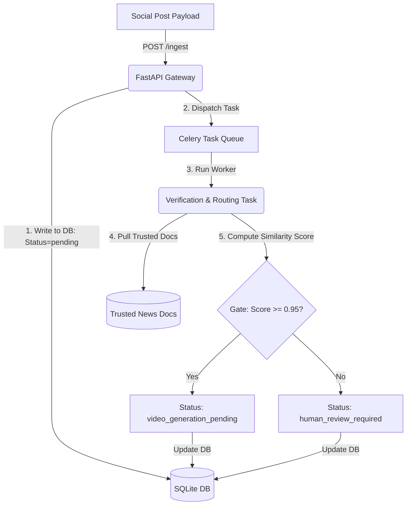

# News AI - Phase 1: Ingestion & Verification Engine

Welcome to the foundational codebase for **News AI**—an event-driven ingestion and verification microservice. This service simulates scraping trending social media payloads, cross-references them against trusted news documents using a mathematical text-similarity matching engine (representing a RAG retriever), and routes the payloads based on a deterministic **Confidence Score Gate**.

## Architecture & Flow



1. **Ingestion Layer (FastAPI)**: Exposes endpoints to receive social media posts and manage trusted reference news.
2. **Task Queue (Celery)**: Decouples heavy verification checking from the API request-response cycle.
3. **Verification Layer (RAG Simulation)**: 
   - Chunk-based cosine similarity matcher.
   - Divides trusted news articles into sentences (chunks) to find localized semantic overlaps.
   - Computes cosine similarity of term frequency vectors between the post and the document chunks.
4. **Decision Gate**:
   - $\text{Confidence Score} \ge 0.95$: Content is validated; status set to `video_generation_pending`.
   - $\text{Confidence Score} < 0.95$: Content is unverified; status set to `human_review_required`.

---

## Directory Structure

```
news_ai/
├── app/
│   ├── __init__.py
│   ├── celery_app.py     # Celery app configuration (Redis backend)
│   ├── config.py         # App configurations (settings, environments)
│   ├── database.py       # SQLAlchemy engine & session initialization
│   ├── main.py           # FastAPI server and endpoint routers
│   ├── models.py         # SQLAlchemy models (SocialPost, TrustedDocument)
│   ├── schemas.py        # Pydantic validation schemas
│   ├── tasks.py          # Celery background tasks (asynchronous verification)
│   └── verification.py   # Mathematical Verification / Cosine Similarity engine
├── data/
│   └── trusted_docs/     # Local storage directory for trusted news articles
├── tests/
│   └── test_pipeline.py  # End-to-end integration and verification tests
├── requirements.txt      # Project dependencies
└── README.md             # This guide
```

---

## Local Setup & Installation

### 1. Prerequisites
- **Python 3.12+** (Developed and tested with Python 3.14.0)
- **Redis Server** (Required for running Celery tasks asynchronously in production)

### 2. Install Dependencies
```bash
pip install -r requirements.txt
```

### 3. Running the Test Suite (No Redis Required!)
The test suite utilizes Celery's eager mode (`NEWS_AI_CELERY_TASK_ALWAYS_EAGER=True`) to run tasks synchronously in-memory. This allows testing all API and verification flows instantly without running a Redis instance:
```bash
python -m pytest tests/test_pipeline.py -v -s
```

---

## Running the Development Server (Redis Required)

To run the application with real asynchronous Celery background tasks:

### 1. Start Redis
Ensure a Redis server is running locally on port `6379`.
- **Windows**: Start Redis via WSL or run `redis-server.exe` directly.

### 2. Start the Celery Worker
Run the following command in the project root directory:
```bash
celery -A app.celery_app worker --loglevel=info
```

### 3. Start the FastAPI API Server
In a separate terminal, launch the FastAPI server:
```bash
uvicorn app.main:app --reload --port 8000
```
The interactive documentation will be available at [http://127.0.0.1:8000/docs](http://127.0.0.1:8000/docs).

---

## API Documentation & Usage Examples

### 1. Seed Trusted News Documents
Submit a trusted news article to the database and filesystem:
```bash
curl -X POST "http://127.0.0.1:8000/trusted-docs" \
     -H "Content-Type: application/json" \
     -d '{"title": "Solar Storm Warning", "content": "A massive solar flare is heading towards Earth, expected to cause a global internet blackout tomorrow."}'
```

### 2. Ingest a Social Media Post
Submit raw social media content (e.g. from X or Instagram). The system will return a `pending` status while the verification task is scheduled:
```bash
curl -X POST "http://127.0.0.1:8000/ingest" \
     -H "Content-Type: application/json" \
     -d '{
       "source": "X",
       "post_id": "post_999",
       "username": "space_tracker",
       "content": "A massive solar flare is heading towards Earth, expected to cause a global internet blackout tomorrow.",
       "timestamp": "2026-06-18T20:00:00Z",
       "metadata": {
         "likes": 520,
         "retweets": 12
       }
     }'
```

### 3. Check Post Verification & Routing Status
Fetch the post to see its calculated score, matched document reference, and output route:
```bash
curl -X GET "http://127.0.0.1:8000/posts/post_999"
```

Response JSON (Passed Gate):
```json
{
  "id": 1,
  "post_id": "post_999",
  "source": "X",
  "username": "space_tracker",
  "content": "A massive solar flare is heading towards Earth, expected to cause a global internet blackout tomorrow.",
  "timestamp": "2026-06-18T20:00:00Z",
  "likes": 520,
  "retweets": 12,
  "confidence_score": 1.0,
  "status": "video_generation_pending",
  "matched_document_id": 1,
  "matched_snippet": "A massive solar flare is heading towards Earth, expected to cause a global internet blackout tomorrow....",
  "created_at": "2026-06-18T20:10:00Z",
  "updated_at": "2026-06-18T20:10:05Z"
}
```
If the score was $< 0.95$, the `status` would be `human_review_required` and it would be kept out of the automated video generation pipeline.
